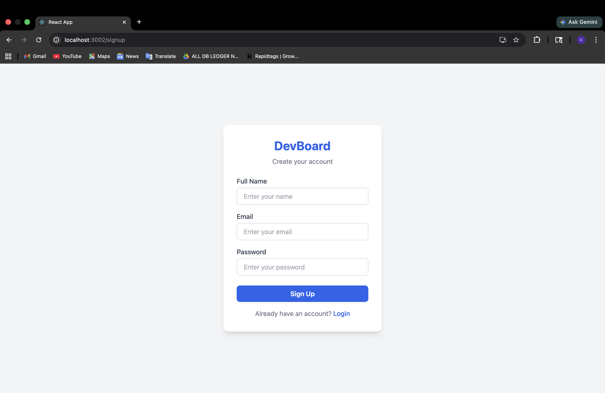
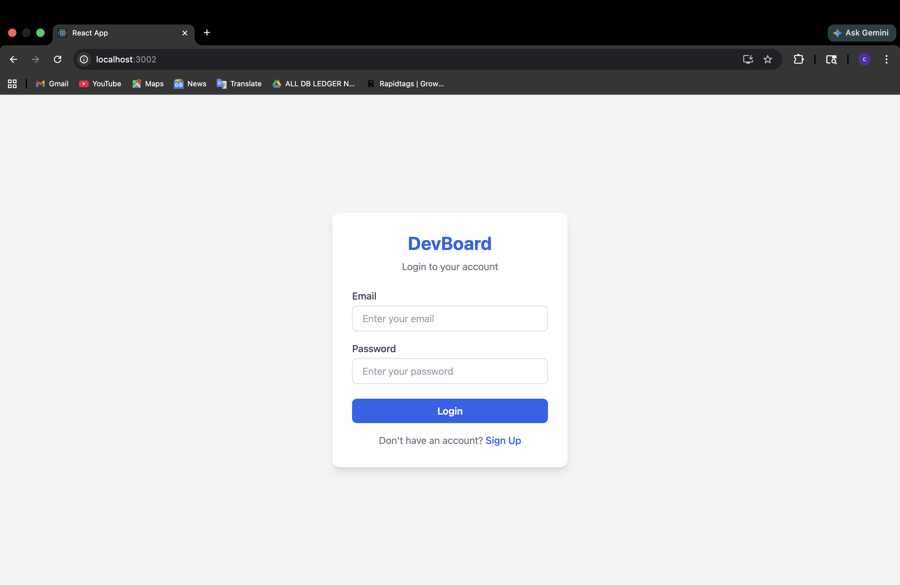
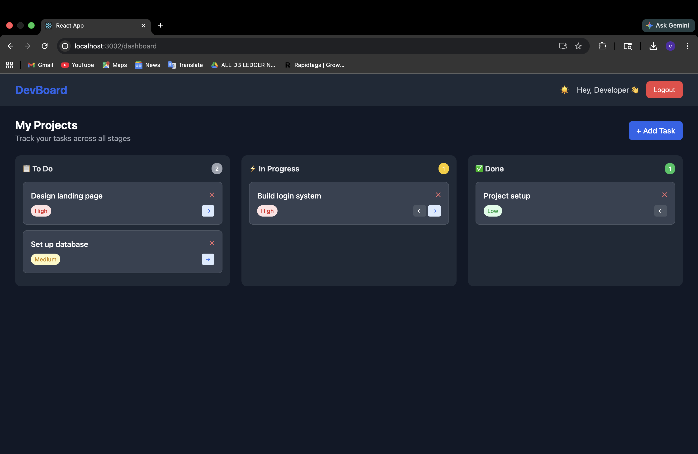

# DevBoard 🚀

A developer task and project tracker built with React.

## Features
- 🔐 Login & Signup pages
- 📋 Kanban board with To Do, In Progress, Done columns
- ➕ Add tasks with priority levels (High, Medium, Low)
- 🗑️ Delete tasks
- 🔄 Move tasks between columns
- 🌙 Dark mode toggle

## Tech Stack
- React.js
- Tailwind CSS
- React Router DOM

## Screenshots

### Login Page


### Dashboard - Light Mode


### Dashboard - Dark Mode


### Add Task


### Add Task with Priority


## Getting Started
```bash
npm install
npm start
```